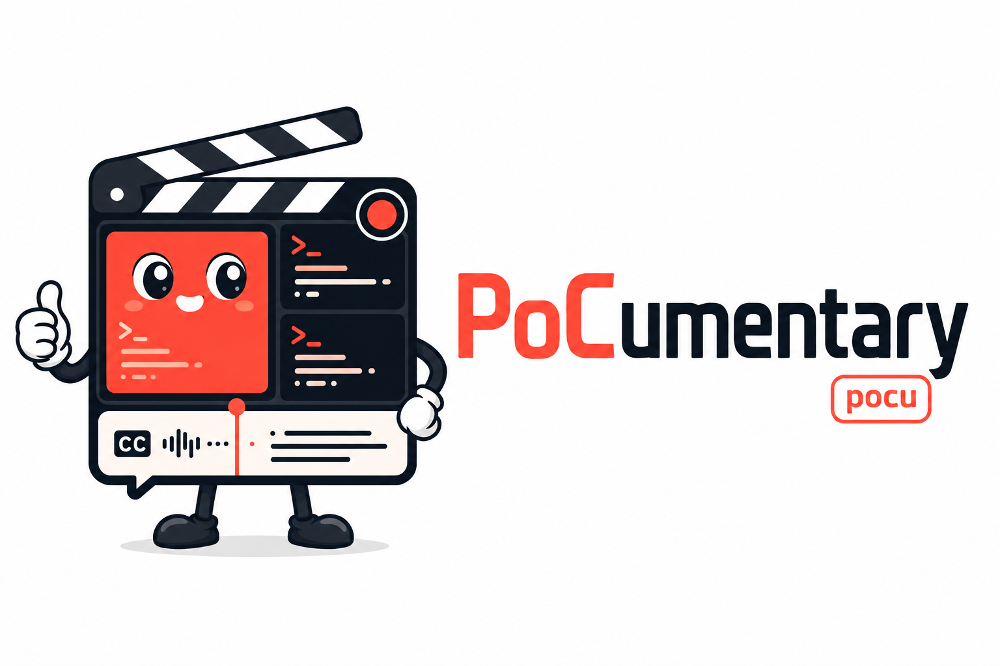

<p align="center">
  
</p>

<p align="center">
  <a href="https://pillar.security">
    <picture>
      <source media="(prefers-color-scheme: dark)" srcset="docs/pillar-logo-light.svg">
      
    </picture>
  </a>
  <br>
  <sub>An open-source project from <a href="https://pillar.security">Pillar Security</a></sub>
</p>

# PocYeah

**Turn a proof-of-concept into a narrated screen-recording — from one declarative spec, repeatably. On Linux, Windows, and macOS.**

PocYeah is a spec-driven CLI for building multi-terminal demo recordings. You
describe a demo once in a `demo.toml` — the panes, the commands they run, how they
hand off to each other, and plain-language captions for each step — and PocYeah
runs each pane in a real pseudo-terminal, tiles them, renders the terminals to
video itself, and burns event-anchored subtitles (or speaks them) onto the take.
The captions stay in sync because they anchor to demo **events**, not wall-clock
seconds, so you can re-word them without re-recording.

**Recording is fully portable and headless.** Instead of driving a GUI terminal
and screen-recording it, PocYeah emulates each pane's terminal in-process and
paints the frames itself, piping raw video to `ffmpeg`. That means the same take
runs identically on Linux, Windows, and macOS — no screen-recording permission, no
display server, no Terminal.app — so it even works in CI.

> This is a cross-platform fork of the original
> [pillar-labs/pocumentary](https://github.com/pillar-labs/pocumentary) (macOS-only,
> AppleScript + AVFoundation). The recording engine has been reworked around a
> portable pseudo-terminal renderer; the spec format, the event-anchored caption
> pipeline, and the pure/effect architecture are preserved. MIT-licensed, like the
> original.

The command is `pocyeah` (or the short alias **`pocu`**).

```bash
pocu scaffold my-demo/                       # write a working starter demo.toml
pocu validate my-demo/demo.toml              # pure schema check, no screen
pocu dryrun   my-demo/demo.toml              # run the roles headless, assert success
pocu layout   my-demo/demo.toml              # render a still PNG preview of the tiling
pocu record   my-demo/demo.toml              # the take -> recording.mov (+ timeline)
pocu annotate my-demo/demo.toml recording.mov # burn [[annotation]] captions + [[overlay]] GIFs -> -captioned.mov
pocu narrate  my-demo/demo.toml recording.mov # speak the captions instead -> -narrated.mov
pocu explain                                 # print the full demo.toml schema reference
```
## Worked example

[`examples/langroid-cypher-rce/`](examples/langroid-cypher-rce/) is a full demo:
a three-terminal reproduction of a real, published critical CVE
([CVE-2026-55615](https://github.com/advisories/GHSA-2pq5-3q89-j7cc), CVSS 9.2) —
a Cypher injection in langroid's `Neo4jChatAgent` that ends in remote code
execution (a real `popcalc`). Its caption/narration track walks the four steps of
the attack and can be burned in as subtitles or spoken as TTS narration; it runs
on plain `python3` with no extra dependencies. See its README for more information about the vulnerability, killchain diagram, and run commands.
`examples/gated-demo.toml` is a smaller two-pane handshake if you just want to
see the mechanics.

[langroid-cypher-rce-demo.webm](https://github.com/user-attachments/assets/0cb21bbc-2fc2-407b-84d1-c9dca2e3fcb5)


## Why

In an age where we ship more findings than any of us can keep up with, the bug
is only half the battle — someone still has to *believe* you. A wall of text and
a stack trace don't land; a clean, narrated repro does. In a world drowning in
findings, you need the right tools by your side. Enter PocYeah.

Recording a clean multi-actor PoC by hand is fiddly and fragile: terminals must be
placed and titled, actors must start in the right order, the frame must show just
the demo, and captions drift the moment a step takes longer than last take.
PocYeah makes the whole thing declarative and repeatable, and keeps the
timing-sensitive parts (layout math, gating, framing, captioning) pure and
unit-tested so a demo behaves the same every run — on every OS.

## Install

Requires Python ≥ 3.11 and [`uv`](https://docs.astral.sh/uv/). The **core** has
no runtime dependencies (stdlib only) — `validate`, `dryrun`, `annotate`, `narrate`,
`scaffold`, and `explain` all run with nothing extra. Recording adds a small,
cross-platform stack, and `ffmpeg` is always shelled out.

```bash
git clone <this-repo> && cd pocyeah
uv run pocu --help          # uv resolves the project and both entry points

# Recording (`record`, `layout`) needs ffmpeg plus the recorder extra
# (pyte + Pillow, and pywinpty on Windows). Install ffmpeg for your OS:
#   Linux:    sudo apt install ffmpeg          (or your distro's package)
#   macOS:    brew install ffmpeg
#   Windows:  winget install Gyan.FFmpeg       (or scoop/choco)
uv sync --extra record            # pyte, Pillow, (pywinpty on Windows)

# Optional: spoken narration (`narrate`) uses ElevenLabs (cloud, high quality).
uv pip install 'pocyeah[tts]'

# Optional cross-platform fallback: on-device TTS (Piper) used automatically when
# no API key is set. Works on Linux, Windows and macOS; downloads a ~60 MB voice
# to a per-user cache on first run (or point $POCYEAH_PIPER_MODEL at a .onnx).
uv pip install 'pocyeah[tts-local]'
```

`record` and `narrate` shell out to `ffmpeg` (and `narrate` to `ffprobe`, which
ships with ffmpeg). No screen-recording, accessibility, or automation permissions
are needed on any OS — the recorder never touches the real screen.

### Narration credentials (ElevenLabs)

`narrate` resolves an ElevenLabs API key at run time — it never stores one.
It looks in this order: the `ELEVENLABS_API_KEY` environment variable, then a
`.env` beside the `demo.toml`, then a `.env` in the current directory. **If no
key is found it falls back to the on-device engine automatically** (install
`pocyeah[tts-local]` for that path).

```bash
# Global (every `pocu narrate`, anywhere) — add to your shell profile:
#   Linux/macOS (bash/zsh):  echo 'export ELEVENLABS_API_KEY=sk_...' >> ~/.bashrc
#   Windows (PowerShell):    setx ELEVENLABS_API_KEY "sk_..."

# Per-project — drop a git-ignored .env beside the demo (keeps it out of history):
echo 'ELEVENLABS_API_KEY=sk_your_key_here' > my-demo/.env
```

A globally-installed `pocu` (see below) runs in its own venv but still inherits
your shell environment, so the shell-profile export reaches it with no extra
setup. Pick a voice/model in the demo's `[tts]` block (see `pocu explain`).

### Install globally (run `pocu` anywhere)

Use uv's tool installer (the pipx equivalent) to put both `pocu` and
`pocyeah` on your PATH, in an isolated environment:

```bash
# From a clone of this repo. --editable makes the global command track your
# working copy, so edits and `git pull`s take effect with no reinstall.
uv tool install --editable .

# Include recording and spoken narration in the global tool as well (the recorder
# extra + ElevenLabs + the cross-platform Piper fallback). The API key comes from
# your shell profile — see "Narration credentials" above; the global tool inherits it.
uv tool install --editable . --with pyte --with pillow --with elevenlabs --with piper-tts

pocu --help                 # now works from any directory
```

The executables land in `~/.local/bin` (run `uv tool update-shell` once if that
isn't on your PATH). Manage the install with `uv tool upgrade pocyeah` and
`uv tool uninstall pocyeah`. Note: an `--editable` install points at the
directory you ran it from — moving or deleting that clone breaks the command.

## The workflow

PocYeah is built around a cheap inner loop and one expensive step:

1. **`scaffold`** writes a runnable starter `demo.toml` + role stubs.
2. **`validate`** is a pure schema check — no screen, instant.
3. **`dryrun`** runs the roles headless and flat-out, sequenced by their gates,
   and exits non-zero unless the demo's `[verify]` predicate holds. This is how
   you iterate without paying for a screen take.
4. **`record`** is the one expensive step: run each pane in a pseudo-terminal,
   tile and render the terminals to frames, encode them with ffmpeg, and write
   `recording.mov` plus a `recording.mov.timeline.json` sidecar mapping each event
   to its video offset. (Preview the tiling first, instantly, with `pocu layout`.)
   Add **`--split`** to render each pane to its **own** independent video
   (`recording-1-<title>.mov`, …) — detachable windows you can place anywhere on a
   monitor — instead of one composite. Prefer stacked over a wide strip? Set
   `[layout] mode = "rows"`.
5. **`annotate`** / **`narrate`** consume that timeline to burn captions (and any
   `[[overlay]]` GIFs) or mix spoken audio onto the take — re-runnable, so
   re-wording never needs a new take.

## The `demo.toml`

Run `pocu explain` for the authoritative, always-current reference. In brief:

```toml
[recording]                 # all optional
fps = 30
cols = 80                   # character columns per pane terminal
rows = 24                   # character rows per pane terminal
theme = "dark"              # "dark" | "light"
font_size = 16              # monospace font size in pixels
step_delay = 2.0            # readable per-step pacing, baked in as $DEMO_STEP_DELAY
hold = 6.0                  # keep rolling this long after the last pane finishes

[layout]
mode = "columns"            # "columns" | "rows" | "grid"

[verify]                    # optional success predicate
expect = ["done"]           # handshake files that must exist when the demo ends

[[pane]]                    # one or more
title = "1 SERVER"
cmd = "python server.py"    # paths resolve against the demo.toml's directory
signals = ["server_ready"]  # handshake files this pane emits (under $DEMO_RUNTIME_DIR)

[[pane]]
title = "2 CLIENT"
cmd = "python client.py"
gate_on = "server_ready"    # do not start until an earlier pane emits this signal

[[annotation]]              # optional caption, zero or more
on = "server_ready"         # WHEN it appears: "start" | a signal name | "pane:<title>"
text = "The server is up and listening."
duration = 4.0

[[overlay]]                 # optional image/GIF easter egg, zero or more
on = "takeover"             # same anchors as [[annotation]]
gif = "boom.gif"            # local path OR an http(s) URL fetched at annotate time
duration = 3.0              # seconds it pops on screen, then off
scale = 0.4                 # width as a fraction of the frame
position = "center"         # center | top-left | top-right | bottom-left | bottom-right

[tts]                       # optional, for `narrate` (ElevenLabs)
voice_id = "ySr9tfpEeN2Sp5JTEEW1"
model_id = "eleven_multilingual_v2"
speed = 1.0                 # ElevenLabs voice-setting rate (~0.7–1.2)
```

**Events and timing.** Every pane's command sees `$DEMO_RUNTIME_DIR` (a shared
handshake directory) and `$DEMO_STEP_DELAY` (the pacing beat). A pane emits a
signal by touching `$DEMO_RUNTIME_DIR/<name>`; another pane can `gate_on` it, and
a caption can anchor `on` it. The recorder's timeline captures the offset of
`start`, each `pane:<title>` opening, and each signal — those are the anchors
`annotate`/`narrate` line captions up to.

**Authoring captions.** Write one short, complete, grammatical sentence per step.
`validate` warns when a line looks too long to speak within its `duration`, and
`narrate` errors if a synthesized clip would overrun the gap to the next event.

## Driving PocYeah with an AI agent

The repo ships a [Claude Code](https://claude.com/claude-code) skill —
[`.claude/skills/using-pocyeah/SKILL.md`](.claude/skills/using-pocyeah/SKILL.md) —
that teaches an agent the workflow: iterate headlessly with `dryrun`, spend the
one expensive `record`, then re-run `annotate`/`narrate`, plus the sharp edges
(the timeline-sidecar contract, recording requirements, safety).

- **In this repo:** nothing to install. Claude Code auto-discovers project skills
  under `.claude/skills/`, so an agent working here loads it when it's relevant;
  you can also invoke it explicitly with `/using-pocyeah`.
- **Anywhere (a global install of `pocu`, driving demos in other repos):** copy
  the skill into your personal skills directory so it travels with you:

  ```bash
  cp -r .claude/skills/using-pocyeah ~/.claude/skills/
  ```

It's a reference skill — reading it (or `pocu explain`) is meant to replace
digging through `src/` to figure out how to drive the tool.

## Architecture

PocYeah keeps a strict **pure/effect split**. The pure modules (`spec`,
`layout`, `render`, `theme`, `cmd`, `ffmpeg`, `gates`, `subtitles`, `narration`,
`overlay`, `scaffold`, `explain`) do all the reasoning — schema parsing, cell
tiling and pixel geometry, colour resolution, gate-wiring checks, the
event→subtitle transform, the ffmpeg argv — with no I/O, so they are unit-tested
without a screen. The effect edges (`ptyio`, `terminal`, `frame`, `record`,
`postprod`, `synth`, `cli`) are thin wrappers that actually spawn the PTYs, drive
the terminal emulator, paint frames, and run ffmpeg and the TTS engine. Recording
runs each pane through a pseudo-terminal (`ptyio`: stdlib `pty` on POSIX,
`pywinpty`/ConPTY on Windows), feeds the bytes to an in-process terminal emulator
(`pyte`), and paints frames with Pillow — no GUI terminal, no screen capture.
Spoken narration prefers ElevenLabs (cloud, opt-in `pocyeah[tts]` extra) and
falls back to the cross-platform Piper engine (`pocyeah[tts-local]`) when no
API key is set — the key is resolved from the environment or a project `.env` and
never stored by the tool.

## Tests

```bash
uv run pytest -q          # the full suite (pure core is exhaustively covered)
```

Continuous integration (`.github/workflows/ci.yml`) runs the suite **and** an
end-to-end `record --split` on both **Linux and Windows** on every push, so the
cross-platform recorder (stdlib `pty` / winpty) stays proven. Recordings from
each run are uploaded as downloadable artifacts.

## Running demos safely

**A `demo.toml` is code.** `record` and `dryrun` execute each pane's `cmd` on
your machine, as you, with your privileges. Running whatever the spec says to run
is by design — PocYeah is a PoC recorder, and a PoC *is* an exploit (the
worked example ends in a real `popcalc`). That makes running code responsibly
your call: only run demos you wrote or have read, and isolate anything untrusted
(a container, a throwaway VM) as you see fit. You are responsible for what you
choose to run.

## Status & limits

- `record` is **cross-platform** (Linux, Windows, macOS). It renders its own
  terminals to video via a pseudo-terminal + emulator, so there is no GUI
  terminal, no screen-capture, and no OS permission prompt. Frame size follows
  `[recording] cols`/`rows`/`font_size`.
- Windows recording uses `pywinpty` (ConPTY), installed by the
  `pocyeah[record]` extra. Full-screen curses/TUI apps render as their
  terminal output; interactive input isn't driven (panes run their `cmd`).
- `target = "ssh:<host>"` (remote panes) is parsed but reserved for a future
  release; only `local` runs today.
- Authorized use only. PocYeah records whatever you tell it to run.