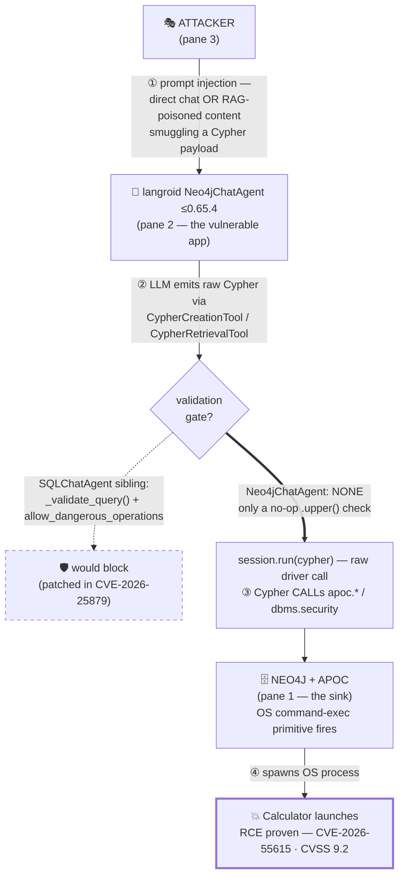

# langroid Neo4jChatAgent Cypher injection → RCE (CVE-2026-55615)

A complete PocYeah demo: three gated terminals reproduce the killchain of a
**real, published, patched** critical vulnerability in
[`langroid`](https://github.com/langroid/langroid) ≤ 0.65.4
([GHSA-2pq5-3q89-j7cc](https://github.com/advisories/GHSA-2pq5-3q89-j7cc),
CVE-2026-55615, **CVSS 9.2**, CWE-74). A caption track explains each beat, and
The payoff is a `popcalc` — Calculator launches on the database host. This vulnerability was responsibly reported by Matteo Panzeri (@matte1782) :clap: :clap: :clap:.

## The killchain



## What it shows

`Neo4jChatAgent` passes LLM-generated Cypher straight to the Neo4j driver with
no `allow_dangerous_operations` gate and no `_validate_query()`. Its sibling
`SQLChatAgent` received exactly those guards when the analogous SQL-injection
flaw (CVE-2026-25879) was fixed, but the Neo4j module was left unprotected — the
write path does only a no-op `.upper()` substring check that rejects nothing. So
whoever influences the prompt (directly, or via RAG-retrieved content the agent
trusts) controls the executed query. On an instance with APOC / `dbms.security`
procedures enabled, that query reaches the OS.

| Pane | Role | `gate_on` | `signals` |
|------|------|-----------|-----------|
| **1 NEO4J+APOC** | the backend sink — runs any Cypher the agent sends; APOC exec launches **Calculator** | — | `db_ready`, `rce` |
| **2 AGENT** | a langroid `Neo4jChatAgent` stand-in — forwards LLM-produced Cypher with **no validation** | `db_ready` | `agent_ready`, `cypher_emitted`, `forwarded` |
| **3 ATTACKER** | an untrusted prompt that smuggles a `CALL apoc.os.exec([...])` payload past the agent | `agent_ready` | `injected` |

The take walks through the four steps of the diagram, each as its own on-screen
beat with a caption: **Step 1 — injection** (`injected`), **Step 2 — the LLM
writes the query** (`cypher_emitted`), **Step 3 — no guardrail** (`forwarded`),
and **Step 4 — execution** (`rce`, Calculator launches).

## Fidelity — what is real, what is stubbed

A live exploit would need a Neo4j + APOC server, an LLM key, and
`langroid ≤ 0.65.4`, none of which is shippable or CI-runnable. This example is
therefore a **self-contained reproduction** using only the Python standard
library — no network egress, no API key, no real Neo4j or LLM. It mirrors the
real data flow faithfully:

- the **attacker → agent** hop is a chat prompt (a file drop),
- the **agent → database** hop is a real localhost socket — the "driver session",
- the agent's handler reproduces the vulnerable code path: LLM-chosen Cypher goes
  to `session.run()` with no gate and no validation, and
- the **RCE is genuine**: the backend runs the attacker-controlled OS command and
  Calculator actually launches.

`apoc.os.exec` stands in for the APOC / `dbms.security` OS-command surface the CVE
reaches when those procedures are enabled; the exact procedure a real attacker
uses depends on the target's configuration. The point of the CVE — and of this
demo — is not that procedure, but that the agent runs attacker-controlled Cypher
**unchecked**. Authorized security research; educational reproduction only.

## Run it

Runs on plain `python3` (standard library only) — no virtualenv or extra deps.

```bash
# 1. Schema check (pure, no screen).
uv run pocu validate examples/langroid-cypher-rce/demo.toml

# 2. Headless proof — runs all three roles, gated, and FAILS unless the RCE
#    actually lands (verify expects the `rce` signal, which the backend writes
#    only after it spawns the OS command). NOTE: this launches Calculator.
uv run pocu dryrun examples/langroid-cypher-rce/demo.toml

# 3. The take (runs all three roles in PTYs and renders them to video; any OS).
#    Writes langroid-cypher-rce-<stamp>.mov and a .mov.timeline.json sidecar.
uv run --extra record pocu record examples/langroid-cypher-rce/demo.toml

# 4. Burn the caption track onto the take (re-runnable; edit captions and
#    re-run without another recording).
uv run pocu annotate examples/langroid-cypher-rce/demo.toml \
  examples/langroid-cypher-rce/langroid-cypher-rce-<stamp>.mov
#   -> langroid-cypher-rce-<stamp>-captioned.mov

# 5. (optional) Speak the captions instead. Needs ElevenLabs
#    (uv pip install 'pocyeah[tts]' + an API key) or the on-device fallback
#    (uv pip install 'pocyeah[tts-local]').
uv run pocu narrate examples/langroid-cypher-rce/demo.toml \
  examples/langroid-cypher-rce/langroid-cypher-rce-<stamp>.mov
#   -> langroid-cypher-rce-<stamp>-narrated.mov
```

The recording and its sidecars are git-ignored (`*.mov`, `*.mov.timeline.json`).

## Root cause & fix

Fixed in langroid **0.65.5**, which mirrors the SQL controls onto the Neo4j
module: an `allow_dangerous_operations` gate (default `False`), read-only
restrictions on retrieval tools, and rejection of code-execution and file/network
primitives (`LOAD CSV`, `apoc.*`, `dbms.*`) unless explicitly enabled. If you use
`Neo4jChatAgent`, upgrade to ≥ 0.65.5 and leave `allow_dangerous_operations` off.
